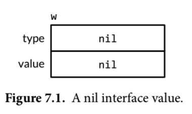
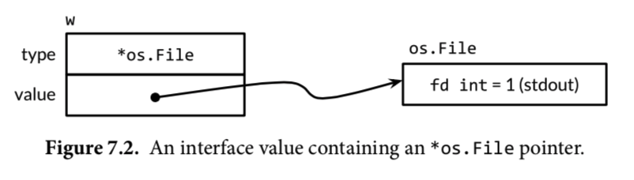
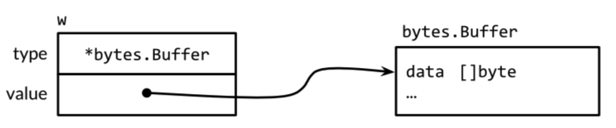
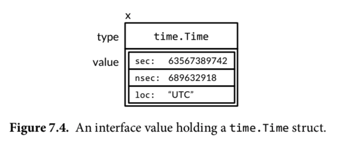

# The Go Programming Language

<!-- @import "[TOC]" {cmd="toc" depthFrom=2 depthTo=6 orderedList=false} -->

<!-- code_chunk_output -->

- [The Go Programming Language](#the-go-programming-language)
  - [Program Sturcture](#program-sturcture)
    - [Reserved Names](#reserved-names)
    - [Declarations](#declarations)
    - [Variables](#variables)
      - [Short Variable Declarations](#short-variable-declarations)
      - [Pointers](#pointers)
      - [The new function](#the-new-function)
      - [Lifetime of Varianles](#lifetime-of-varianles)
    - [Assignments](#assignments)
      - [Tuple Assignments](#tuple-assignments)
      - [Assignability](#assignability)
    - [Type Declarations](#type-declarations)
    - [Packages and Files](#packages-and-files)
      - [Imports](#imports)
      - [Package Initialiation](#package-initialiation)
    - [Scope](#scope)
  - [Basic Data Types](#basic-data-types)
    - [Intergers](#intergers)
    - [Floating-Point Numbers](#floating-point-numbers)
    - [Complex Numbers](#complex-numbers)
    - [Boolean](#boolean)
  - [Strings](#strings)
    - [String Literals](#string-literals)
    - [Unicode](#unicode)
    - [UTF-8](#utf-8)
    - [Strings and Byte Slices](#strings-and-byte-slices)
    - [Conversions between Strings and Numbers](#conversions-between-strings-and-numbers)
    - [Constants](#constants)
      - [The Constant Generator iota](#the-constant-generator-iota)
      - [Untyped Constants](#untyped-constants)
  - [Composite Types](#composite-types)
    - [Arrays](#arrays)
    - [Slices](#slices)
      - [The append Function](#the-append-function)
      - [In-Place Slice Techniques](#in-place-slice-techniques)
    - [Maps](#maps)
    - [Structs](#structs)
      - [Struct Literals](#struct-literals)
      - [Comparing Structs](#comparing-structs)
      - [Sturct Embedding and Anonymous fields](#sturct-embedding-and-anonymous-fields)
      - [Json](#json)
      - [Text and HTML Templates](#text-and-html-templates)
  - [Functions](#functions)
    - [Function Declarations](#function-declarations)
    - [Recursion](#recursion)
    - [Multiple Return Values](#multiple-return-values)
    - [Errors](#errors)
      - [Error-Handling Strategies](#error-handling-strategies)
      - [End of File(EOF)](#end-of-fileeof)
      - [Function Values](#function-values)
    - [Anonymous Functions](#anonymous-functions)
      - [Caveat: Capturing Iteration Variables](#caveat-capturing-iteration-variables)
    - [Variadic Functions](#variadic-functions)
    - [Defered Function Calls](#defered-function-calls)
    - [Panic](#panic)
    - [Recover](#recover)
  - [Methods](#methods)
    - [Method Declarations](#method-declarations)
    - [Methods with a Pointer Receiver](#methods-with-a-pointer-receiver)
      - [Nil Is a Valid Receiver Value](#nil-is-a-valid-receiver-value)
    - [Composing Types by Struct Embedding](#composing-types-by-struct-embedding)
    - [Method Values and Expressions](#method-values-and-expressions)
    - [Example: BIt Vector Type](#example-bit-vector-type)
    - [Encapsulation](#encapsulation)
  - [Interfaces](#interfaces)
    - [Interfaces as Contracts](#interfaces-as-contracts)
    - [Interface TYpes](#interface-types)
    - [Interface Satisfaction](#interface-satisfaction)
    - [Parsing Flags withe flag.Value](#parsing-flags-withe-flagvalue)
    - [Interface Values](#interface-values)
      - [Caveat: An Interface Containing a Nil Pointer Is Non-Nil](#caveat-an-interface-containing-a-nil-pointer-is-non-nil)
    - [Sotring with sort.Interface](#sotring-with-sortinterface)
    - [The http.Handler Interface](#the-httphandler-interface)
    - [The error Interface](#the-error-interface)
    - [Example: Expression Evluator](#example-expression-evluator)
    - [Type Assertions](#type-assertions)
    - [Discriminating Errors with Type Assertions](#discriminating-errors-with-type-assertions)
    - [Querying Behabiors with Interface Type Assertions](#querying-behabiors-with-interface-type-assertions)
    - [Type Switches](#type-switches)
    - [Example:Tken-Based XMLl Decoding](#exampletken-based-xmll-decoding)
    - [A Few Words of Advice](#a-few-words-of-advice)
  - [Goroutines and Channels](#goroutines-and-channels)
    - [Goroutines](#goroutines)
    - [Example: Concurrent Clock Server](#example-concurrent-clock-server)
    - [Example: Concurrent Echo Server](#example-concurrent-echo-server)
    - [Channels](#channels)
      - [Unbuffered CHannels](#unbuffered-channels)
      - [Pipelines](#pipelines)
      - [Unidirectional Channel Types](#unidirectional-channel-types)
      - [Buffered Channels](#buffered-channels)
    - [Looping in Parallel](#looping-in-parallel)
    - [Example: concurrent Web Crawler](#example-concurrent-web-crawler)
    - [Multiplexing with select](#multiplexing-with-select)
    - [Example: Concurrent Directory Traversal](#example-concurrent-directory-traversal)
    - [Cancellation](#cancellation)
    - [Example: Chat Server](#example-chat-server)
  - [Concurrency with Shared Variables](#concurrency-with-shared-variables)
    - [Race Conditions](#race-conditions)
    - [Mutual Exclusion:sync.Mutex](#mutual-exclusionsyncmutex)
    - [Read/Write Mutexes: sync.RWMutex](#readwrite-mutexes-syncrwmutex)
    - [Memory Synchronization](#memory-synchronization)
    - [Lazy Initialization: sync.Once](#lazy-initialization-synconce)
    - [The Race Detector](#the-race-detector)
    - [Example: Concurrent Non-Blocking Cache](#example-concurrent-non-blocking-cache)
    - [Goroutines and Threads](#goroutines-and-threads)
      - [Growable Stacks](#growable-stacks)
      - [Goroutine Scheduling](#goroutine-scheduling)
      - [GOMAXPROCS](#gomaxprocs)
      - [Goroutines Have No Identity](#goroutines-have-no-identity)
  - [Packages and the Go Tool](#packages-and-the-go-tool)
    - [Introduction](#introduction)
    - [Import Paths](#import-paths)
    - [The Package Declaration](#the-package-declaration)
    - [Import Declarations](#import-declarations)
    - [Blank Imports](#blank-imports)
    - [Packages and Naming](#packages-and-naming)
    - [The Go Tool](#the-go-tool)
      - [Workspace Organization](#workspace-organization)
      - [Downloading Packages](#downloading-packages)
      - [Building Packages](#building-packages)
      - [Documenting Packages](#documenting-packages)
      - [Internal Packages](#internal-packages)
      - [Querying Packages](#querying-packages)
  - [Testing](#testing)
    - [The go test Tool](#the-go-test-tool)
      - [Test Functions](#test-functions)
      - [Randomized Testing](#randomized-testing)
      - [Testing a Command](#testing-a-command)
      - [White-Box Testing](#white-box-testing)
      - [External Test Packages](#external-test-packages)
      - [Writing Effective Tests](#writing-effective-tests)
      - [Aboiding Brittle Tests](#aboiding-brittle-tests)
    - [Coverage](#coverage)
    - [Benchmark Functions](#benchmark-functions)
    - [Profiling](#profiling)
    - [Example Functions](#example-functions)

<!-- /code_chunk_output -->

## Program Sturcture

### Reserved Names

```
break        default      func         interface    select
case         defer        go           map          struct
chan         else         goto         package      switch
const        fallthrough  if           range        type
continue     for          import       return       var
```

[https://golang.google.cn/ref/spec#Keywords]

### Declarations

4 Kinds

- var
- const
- type 
- func 

### Variables

> If the expression is omitt ed, the initial value is the zero value for the typ e, which is 0 for numbers, **false** for boole ans, "" for str ings, and nil for int erfaces and reference typ es (slice, point er, map, channel, function)

#### Short Variable Declarations

`A short variable delaraiion does not necessaily declare all the variable on itss left-hand side. `But it should at least declare a new one.

```go
// Ok
in, err := os.Open(infile)
out, err := os.Open(outfile)
```

```go
f, err := os.Open(infile)
f, err := os.Create(outfile) // compile error: no new variables
```

#### Pointers

#### The new function

> The expression new(T) creates an unname d variab le of typ e T , initializes it to the zero value of T , and retur ns its address, which is a value of typ e *T .

```go
p := new(int)   // p, of type *int, points to an unnamed int variable
fmt.Println(*p) // "0"
*p = 2          // sets the unnamed int to 2
fmt.Println(*p) // "2"
```

#### Lifetime of Varianles

### Assignments

#### Tuple Assignments

```go
a[i], a[j] = a[j], a[i]
```

#### Assignability

### Type Declarations

```go
type Celsisus folat64
type Fahrenheit float64
```

### Packages and Files

#### Imports

#### Package Initialiation

### Scope

## Basic Data Types

Types:

- basic types
- aggregate types
- reference types
- interface types

### Intergers

rune == int32
byte == unit8
int != uint (same bits, but need explict onversion)

-5 % 3 = -2
-5 % -3 = -2

len() return `signed integer`

### Floating-Point Numbers

- float32
- float64, use this 

###  Complex Numbers

- complex64 (float32)
- complex128 (float64)

```go
var x = complex(1, 2)
y := 3 + 4i
```

### Boolean

x == true, or simply x 

short-circuit:
s != "" && s[0] == 'x'

## Strings

Immutable

### String Literals


> Raw str ing lit erals are a convenient way to write regular expressions, which tend to have lots of backsl ashes. They are also us eful for HTML templ ates, JSON lit erals, command usage messages, and the like, which often extend over multiple lines.

```go
const GoUsage = `Go is a tool for manging Go source code.

Usage:
    go command [arguments]
`
```

### Unicode

### UTF-8

| binary                             | range          | values                |
| ---------------------------------- | -------------- | --------------------- |
| 0xxxxxx                            | runes 0−127    | (ASCII)               |
| 11xxxxx 10xxxxxx                   | 128−2047       | (values <128 unused)  |
| 110xxxx 10xxxxxx 10xxxxxx          | 2048−65535     | (values <2048 unused) |
| 1110xxx 10xxxxxx 10xxxxxx 10xxxxxx | 65536−0x10ffff | (other values unused) |


```go
import "unicode/utf8"

s := "Hello, 世界"
fmt.Println(len(s)) // "13"
fmt.Println(utf8.RuneCountInString(s)) // "9"
```


### Strings and Byte Slices

> A string contains an array of bytes that, once created, is immutable. By contrast, the elements of a byte slice can be freely modified.

```go
s := "abc"
b := []byte(s)
s2 := string(b)
```

### Conversions between Strings and Numbers

```go
x := 123
y := fmt.Sprintf ("%d", x)
fmt.Println (y, strconv.Itoa(x)) // "123 123"


x, err := strconv.Atoi ("123") // x is int
y, err := strconv.ParseInt("123", 10, 64) // base 10, up to 64 bits
```

### Constants

#### The Constant Generator iota

```go
const (
    _ = 1 << (1 * iota)
    KiB  // 1024
    MiB  // 1024 * 1024
    GiB  // 1024 * 1024 * 1024
)
)
```

#### Untyped Constants

## Composite Types

- Array:  homogeneous data type, fixed size
- Slices & Maps: dynamic size


### Arrays

```go
var a [3]int
fmt.Println(a[0])
frmt.Println(a[len(a)-1])

// Index and elements
for i, v := range a {

}

// elements
for _, v := range a {

}

//auto size
q := [...]int{1, 2, 3}

type Currency int
const (
    USD Currency = iota
    EUR
    GBP
    RMB
)

symbol := [...]string{USD: "$", EUR: "e", GBP: "f", RMB: "y", 26: 'z'} // 27 elements
```

> 数组作为参数时是传值的（复制）

### Slices


```go
// array
a := [...]int{1, 2, 3}
// slice
s := []int{1, 2, 3}

var s [] int    // len(s) == 0, s == nil
s = nil         // len(s) == 0, s == nil
s = []int(nil)  // len(s) == 0, s == nil
s = []int{}     // len(s) == 0, s != nil

// not s == nil
if len(s) == 0 {

}

make ([]T, len)
make ([]T, len, cap)
```

#### The append Function


```go
var x []int
x = append (x, 1) // assign it back to x
```

#### In-Place Slice Techniques

```go
func noempty(strings []string) []string {
    i := 0
    for _, s := range strings {
        if s != "" {
            strings[i] = s
            i++
        }
    }
}

// stack
stack = append(stack, v)
top := stack[len(stack) - 1]
// stack shrink
stack = stack[:len(stack) - 1] // error if stack is empty


// preserve order
func remove(slice []int, i int) []int {
    copy(slice[i:], slice[i+1:])
    return slice[:len(slice)-1]
}

// out of order
func remove(slice []int, i int) []int {
    slice[i] = slice[len(i) - 1]
    return slice[:len(slice)-1]
}
```

### Maps


```go
ages := make(map[string]int)
// or ages := map[string]int{}

ages["alice"] = 31

delete(ages, "alice")

// no need to init
ages["bob"] // 0, the default empyt value
ages["bob"] += 1

// iter
for name, age := range {
    // do something
}

// iter by order
import "sort"
names := make ([]string, 0, len(ages))
for name := range ages {
    names = append (names, name)
}
sort.Strings(names)
for _, name := range names {
    fmt.Printf ("%s\t%d\n", name, ages[name])
}

// exists of not
age, ok := ages["bob"]
if !ok { /* error handler */ }

```

### Structs

#### Struct Literals

#### Comparing Structs

If all fields of a struct are comparable, the struct itself is comparable.

#### Sturct Embedding and Anonymous fields

```go
type Point struct {
   X, Y int 
}

type Circle struct {
    Point
    Radius int
}

type Wheel struct {
    Circle
    Spokes int
}

var w Wheel
w.X = 8
w.Y = 8
w.Radius = 5
w.Spokes = 20

w = Wheel{8, 8, 5, 20} // compile error
w = Wheel{X: 8, Y: 8, Radius: 5, Spokes: 20} // compile error

w = Wheel {
    Circle: Circle {
        Point: Point{X: 8, Y:8},
        Radius: 5,
    },
    Spokes: 20,  // comma is necessary
}

fmt.Printf("%#v\n", w) // notice the # sign here, it print the field names
// main.Wheel{Circle:main.Circle{Point:main.Point{X:8, Y:8}, Radius:5}, Spokes:20}
```

#### Json

#### Text and HTML Templates


## Functions

### Function Declarations 

```
func name(parameter-list) (return-list) {

}
```

### Recursion

```go
func hello (a []string) []string {
    return append(a, "hello");
}
fmt.Println(hello(nil))
```

### Multiple Return Values

```go
func CountWordsAndImages(url string) (words, images int, err error) {
    resp, err := http.Get(url)
    if err != nil {
        return
    }
    /...
    return
```

> Go’s garbage collector recycles unused memory, but do not assume it will release unused operating system resources like open files and network connection s. They should be clos edexplicitly.

### Errors

#### Error-Handling Strategies


1. Propagate the errror

```go
resp, err := http.Get(url)
if err != nil {
    return nil, err
}
```

2. Retry the operations


sleep and retry (exponential backoff)

3. Stop the program

should reserved for main package

```go
if err {
    os.Exit(1)
}

if err {
    log.Fatalf("desc of error")
}
```

4. log and continue

with reduced functionality

5. ignore the error

#### End of File(EOF)

```go
in := bufio.NewReader(os.Stdin)
for {
    r, _, err := in.ReadRune()
    if err == io.EOF {
        break // finished reading
    }
    if err != nil {
        return fmt.Errorf ("read failed: %v", err)
    }

    //
}
```

#### Function Values

```go
func square(n int) int { return n * n }
func negative(n int) int { return -n }
func product(m, n int) int { return m * n }

var f func(int) int

f = square
fmt.Println(f(3)) // "9"
f = negative
fmt.Println(f(3))
// "-3"
fmt.Printf("%T\n", f) // "func(int) int"
f = product // compile error: can't assign f(int, int) int to f(int) int
```

### Anonymous Functions

```go
strings.Map (func(r rune) rune {return r + 1,  "HAL-9000") // IBM:.111
```

enclosure

```go
func squares() (func() int) {
    var x int
    return func() int {
        x++
        return x * x
    }
}
```

#### Caveat: Capturing Iteration Variables

```go
var rmdirs []func()

for _, d := range tempDirs() {
    dir := d                // <=== the workaround, declare a variable in each loop
    os.MkdirAll (dir, 0755)
    rmdirs = append 9rmdirs, func() {
        os.RemovaAll(dir)
    })
}

for _, rmdir := range rmdirs {
    rmdir()
}
```

### Variadic Functions

```go
func sum(vals ...int) int {
    total := 0
    for _, val := range vals {
        total += val
    }
    return total
}
```

### Defered Function Calls

1. Release resources/locks...

```go
mu.Lock()
defer mu.Unlock()
```

2. on entry/exit pair

```go
func bigSlowOperation() {
    defer trace ("bigSlowOperation") () // don't forget the //

    time.Sleep (10 * time.Second)
}

func trace (msg string) func () {
    start := time.Now()
    log.Printf ("enter %s", msg)
    return func {log.Printf ("exit %s (%s)", msg, time.Since(start)) }
}
```

> Deferred functions run after return statments have updated the function's result variables.

```go
func docuble(x int) (result int) {
    defer func() {fmt.Printf("double(%d) = %d\n", x, result)}
    return x + x
}
```

> A deferred anonymous function can even change the values that the enclosing function returns to its caller:

```go
func triple (x int) {
    defer func() {result += x}()
    return double(x)
}
```

### Panic

```go
func MustCompile (expr string) *Regexp {
    re, err := Compile (expr)
    if err != nil {
        panic (err)
    }
    return re
}
```

### Recover

> If the built-in recover function is called within a deferred function and the function containing the defer statement is panicking, recover ends the current state of panic and returns the panic value.

```go
func Parse(input Stringl) (s *Syntax, err error) {
    defer func() {
        if p := recover(); p != nil {
            err = fmt.Errorf ("internal error: %v", p)
        }
    }
}
```

```go
package main

import "fmt"

func f() (err error) {
	defer func() {
		if p := recover(); p != nil { // recover() return the panic value
			fmt.Printf("%T %[1]v\n", p) // string oops
			err = fmt.Errorf("internal error: %v", p)
		}
	}()

	panic("oops")

	return nil
}

func main() {
	err := f()
	if err != nil {
		fmt.Println(err)
	}
}
```

> This example does somewhat violate our advice about not using panics for ‘‘expected’’ error s, but it provides a compact illustrat ion of the mechanics.

```go
func soleTitle(doc *html.Node) (title string, err error) {
    type bailout struct{}
    defer func() {
        switch p := recover(); p {
            case nil:
                // no panic
            case bailout{}:
                // "expected" panic
                err = fmt.Errorf("multiple title elements")
            default:
                panic(p) // unexpected panic; carry on panicking
        }
    }()

    panic (bailout{})

}
```

## Methods

### Method Declarations

```go
type Point sturct {X, Y float64}

func Distance (p, q Point ) float64 {
    return mmath.Hypot (q.X-p.X, q.Y-p.Y)
}

type Path []Point
func (path Path)Distance() float64 {
    sum := 0.0
    for I := range path {
        if i > 0 {
            sum += path[i-1].Distance(path[i])
        }
    }
}
```

### Methods with a Pointer Receiver

> Because calling a function makes a copy of each argument value, if a function needs to update a variable, or if an argument is so large that we wish to avoid copy ing it, we must pass the address of the variable using a pointer.

```go
func (p *Point) ScapleBy (factor float64) {
    p.X *= factor
    p.Y *= factor
}

p := Point {1, 2}
pptr = &p
```

> Either the receiver argument has the same type as the receiver parameters, for example both habe type T or both have type *T

```go
Point{1, 2}.Distance(q) // Point
pptr.ScaleBy(2) // *Point

```

> Or the receiver arugment is a bariable of type T nd the receiver parameter has type *T. The compiler implicityly takes the address of the variable.

```go
p.ScaleBy(2)    // implicit (&p)
```

> Or the receiver arugment has type *T and the receiver parameter has type T. The compiler implicitly dereferences the receiver, in other words, load the value:

```go
pptr.Distance (q) // implicit (*pptr)
```

#### Nil Is a Valid Receiver Value

```go
type IntList struct {
    Value int
    Tail *IntList
}

func (list *IntList)sum int {
    if list == nil {    // could be nil
        return 0
    }
    return list.Value + list.Tail.Sum()
}
```

### Composing Types by Struct Embedding


```go
import "image/color"
type Pooint struct {X, Y folat64}

type ColoredPoint struct {
    Point
    COlor color.RGBA
}

red := color.RGBA{255, 0, 0, 255}
var p = ColoredPoint {Point{1,1}, red}
var q = ColoredPoint {Point{5,4}, red}

p.Distance (q.Point) // 注意它的参数，是Point
```

** A struct type may have more than one anonymous field. **

```go
type ColoredPoint struct {
    Point
    color.RGBA
}
```

trick to define method for unamed structure

```go
var cache = struct {            // 定义一个未命名的struct
    sync.Mutex
    mapping map[string]string
} {                             // 实例化一个struct
    mapping: make (map[string])string, 
}

func Lookup (key string) string {
    cache.Lock()                // <=== 直接调用Mutex方法
    v := cache.maping[key]
    cache.Unock()
    return v
}
```

### Method Values and Expressions

```go
type Rocket struct { /* ... */ }
func (r *Rocket) Launch() { /* ... */ }

time.AfterFunc ( 10 * time.Second, r.Launch())
// or time.AfterFunc (10 * time.Second, func() { r.Launch() } )

```

```go
type Point struct{ X, Y float64 }

func (p Point) Distance(q Point) float64 {
	return math.Hypot(q.X-p.X, q.Y-p.Y)
}

func main() {
	p := Point{1, 2}
	q := Point{4, 6}
	mv := p.Distance // method value

	fmt.Printf("%T\n", mv) // func(main.Point) float64
	fmt.Println(mv(q))

	me := Point.Distance // method expression
	fmt.Printf("%T\n", me) // func(main.Point, main.Point) float64
	fmt.Println(me(p, q))
}
```

###  Example: BIt Vector Type

### Encapsulation

benefits

1. Clients cannot directly modify the objet's variables, one need inspect fewer statements to understand the possiblevalues of those variables.
2. Hiding implementation details prevents cleints from depending on things that might change, which gives the designer greater freedom to evolve te implementation without breaking API compatibility.
3. It prevents clients from setting an onject's variables arbitrarily.


## Interfaces

### Interfaces as Contracts

### Interface TYpes

```go
type Reader interface {
    Read (p []byte) (n int, err error)
}

type Closer interface {
    Close() error
}

type ReadWriter interface {
    Reader
    Writer
}
type ReadWriteCloser interface {
    Reader
    Writer
}
```

### Interface Satisfaction

```go
var w io.Writer
w = os.Stdout  // ok
w = new(bytes.Buffer) // ok
w = time.Second // compile error, lacks Write method


type IntSet struct { /* ... */ }
func (*IntSet) String() string

var s IntSet
var _ fmt.Stringer = &s // ok
var _ fmt.Stringer = s // compile error


os.Stdout.Wriet([byte("hello")]) // ok
os.Stdout.Close() // ok

var w io.Writer
w = os.Stdout
w.Write([]byte("hello")) // ok
w.Close() // compile error


// here comes empty interface
var any interface{}
any = true
any = 12.34
any = "hello"
```

### Parsing Flags withe flag.Value


```go
package flag
     // Value is the interface to the value stored in a flag.
     type Value interface {
         String() string
         Set(string) error
}
```

see gopl.io/ch7/tempflag


### Interface Values

> conceptualy, a value of an interface type, or interface value, has two components, a concrete type and a value of that type. These are called the interface's dynamic type and dynamic value.

```go
var w io.Writer
```



```go
w = os.Stdout

fmt.Printf ("%T\n", w) // "*os.File"
```



```go
w = new(bytes.Buffer)
```




```go
var x interface{} = time.Now()
```




#### Caveat: An Interface Containing a Nil Pointer Is Non-Nil

```go
const debug = true
func main() {
    var buf *bytes.Buffer
    if debug {
        buf = new(bytes.Buffer) // enable collection of output
    }
    f(buf) // NOTE: subtly incorrect! it's a non-nil interface containig a nil pointer
}

// If out is non-nil, output will be written to it.
func f(out io.Writer) {             // so, it will receive a not nil value
    // ...do something...
    if out != nil {
        out.Write([]byte("done!\n"))
} }
```

correction:

```go
func main() {
    var buf io.Writer // <======== change it to a interface
    if debug {
        buf = new(bytes.Buffer) // enable collection of output
    }
    f(buf) // OK
}
```


### Sotring with sort.Interface

```go
package sort
type Interface interface {
    Len() int
    Less(i, j int) bool // i,j are the indices
    Swap(i, j int)
}
```

```go
type StringSlice []strig

func (p StringSlice) Len() int {return len(p)}
func (p StringSlice) Less(i, j int) bool { return p[i] < p[j]}
func (p StringSlice) Swap (i, j int) {p[i], p[j] = p[j], p[i]}

sort.Sort(StringSlice(names))
```

The reverse sort

```go
package sort
type reverse struct{ Interface } // that is, sort.Interface
func (r reverse) Less(i, j int) bool { return r.Interface.Less(j, i) }
func Reverse(data Interface) Interface { return reverse{data} }
```

To call the revers sort

```go
sort.Sort(sort.Reverse(StringSlice(names)))
```

tabweriter.writer

### The http.Handler Interface

```go
packag ehttp 
type Handler interface {
    ServeHttp (w ResponseWriter, r *Request)
}

func ListenAndServe(address string, h Handler) error
```


### The error Interface

```go
type error interface {
    Error() string
}
```

### Example: Expression Evluator

TODO: 看不懂

### Type Assertions

> A `type assertion` is an operation applied to an interface value.

1. If the asserted type T is a concrete type, then the type assertion checks whetehr x's dynamic type is identical to T.

```go
var w io.Writer
w = os.Stdout
f := w.(*os.File) // ok
c := w.(*btes.Buffer) // panic
```

2. if instead the asserted t;ype T is an interface type, then the type assertion checks whetehr x's dynamic type satisfies T.

```go
var w io.Writer
w = os.Stdout
rw := w.(io.ReadWriter) // ok

w = new(ByteCounnter)
rw = w.(io.ReadWriter) // panic, no Read method

```

To test dynamic type

```go
var w io.Writer = os.Stdout
f, ok := w.(*os.File) // success: ok, f == os.Stdout
b, ok := w.(*byte.Buffer) // failure: !ok, b == nil
```


### Discriminating Errors with Type Assertions

```go
import (
    "errors"
    "syscall"
)
var ErrNotExist = errors.New("file does not exist")
// IsNotExist returns a boolean indicating whether the error is known to
// report that a file or directory does not exist. It is satisfied by
// ErrNotExist as well as some syscall errors.
func IsNotExist(err error) bool {
    if pe, ok := err.(*PathError); ok {
        err = pe.Err
    }
    return err == syscall.ENOENT || err == ErrNotExist
}
```

### Querying Behabiors with Interface Type Assertions

```go
// writeString writes s to w.
// If w has a WriteString method, it is invoked instead of w.Write.
func writeString(w io.Writer, s string) (n int, err error) {
    type stringWriter interface { // <==== 定义了一个interface
        WriteString(string) (n int, err error)
    }
    if sw, ok := w.(stringWriter); ok {
        return sw.WriteString(s) // avoid a copy
    }
    return w.Write([]byte(s)) // allocate temporary copy
}
```

### Type Switches

```go
func sqlQuote(x interface{}) string {
    switch x := x.(type) { // reuseevariablle name
    case nil:
        return "NULL"
    case int, uint:
        return fmt.Sprintf("%d", x) // x has type interface{} here.
    case bool:
        if x {
            return "TRUE"
        }
            return "FALSE"
    case string:
        return sqlQuoteString(x) // (not shown)
    default:
        panic(fmt.Sprintf("unexpected type %T: %v", x, x))
    }
}
```

### Example:Tken-Based XMLl Decoding

### A Few Words of Advice

避免先定义interface再实现方法，这通常是不需要的.

> We make an exception to this rule when an interface is satisfied by a single concrete type but tat type cannot live in the same package as the interface because of its dependencies.


## Goroutines and Channels

goroutines and channels support `communicating sequential processes`(CSP)

### Goroutines

When main function returns, all goroutines are abruptly terminated.

### Example: Concurrent Clock Server

### Example: Concurrent Echo Server

We had to consider carefully that it is safe to call methods of net.Conn concurrently.

### Channels

#### Unbuffered CHannels

```go
ch := make (chan int)
ch := make (chan int, 0)
```

> Conmmunication over an unbuffered channel causes the sending and receing goroutines to synchronize.

#### Pipelines

```go
for {
    x, ok := <- ch
    if !ok {
        break
    }
    // do something
}

// that's the same
for x := range {
    // do something
}
```

#### Unidirectional Channel Types

```go
func counter(out chan<- int) {
    for x := 0; x < 100; x++ {
        out <- x
    }
    close(out)
}

func squarer(out chan<- int, in <-chan int) {
    for v := range in {
        out <- v * v
    }
    close(out)
}

func printer(in <-chan int) {
    for v := range in {
        fmt.Println(v)
    }
}

func main() {
    naturals := make(chan int)
    squares := make(chan int)
    go counter(naturals)
    go squarer(squares, naturals)
    printer(squares)
}
```

#### Buffered Channels

```go
ch := make (chan int, 3)
```

### Looping in Parallel

```go
func makeThumbnails6(filenames <-chan string) int64 {
    sizes := make (chan int64)   // 1. here's a unbuffered channel, cuz we don't know the size of filenames
    var wg sync.WaitGroup       // counter for number of working goroutines

    for f := range filenames {
        wg.Add(1)
        // worker
        go func (f string)  {// note that it have a parameter
            defer wg.Done()
            thumb, err := thumbnail.ImageFile(f)
            if err != nil {
                log.Println(err)
                return
            }
            info, _ := os.Stat (thumb)
            sizes <- info.Size()
        }(f) // note the parameter f to capture itervation variables (gopl 5.6.1)

    }
    // closer
    go func() { // it have to be parallel, for the channel were **unbuffered**
        wg.Wait()
        close(sizes)
    }()

    var total int64
    for size := range sizes {   // drain the *unbuffered* channel, otherwise all worker will block
        total += size
    }
    return total
    }
```


### Example: concurrent Web Crawler

use buffered channel to control the # of workers.
or 'fork' the # of long-lived goroutines


### Multiplexing with select

> A select with no cases, select{}, wait forever.

> A select may have a default, which specifies what to do when none of the other communications can proceed immediately.

> Because send and receive operations on a nil channel block forever, a case in a selec statement whose channel is nil is never selected.

### Example: Concurrent Directory Traversal

### Cancellation

```go
var done = make(chan struct{})

func cancelled() bool {
    select {
        case <-done:
            return true
        default:
            return false
    }
}
```

> if instead of returning from main in the event of cancellation, we execute a call to panic, then the runtime will dump the stack of every goroutine in the program.

### Example: Chat Server

## Concurrency with Shared Variables

### Race Conditions

- data race
- undefined behavior


How to avoid data race?
1. not to write the variable (init once)
2. avoid  accessing the variable from multiple goroutines.
  (Do not communicate by sharing memory; instead, share memory by communicating)
  alternatively, pipeline
3. Mutual Exclusion

### Mutual Exclusion:sync.Mutex

```go
import "sync"

var (
    mu sync.Mutex // guards balance
    balance int
)

func deposit (amount int){ balance += amount}

func Deposit(amount int) {
    mu.Lock()
    defer mu.Unlock()
    deposit (amount)
}

func Balance() int {
    mu.Lock()
    defer mu.Unlock()
    return balance
}

func Withdraw (amount int) bool {
    mu.Lock()
    defer mu.Unlock()
    deposit(-amount)
    if blanace < 0 {
        deposit(amount)
        return false
    }
    return true
}
```

### Read/Write Mutexes: sync.RWMutex

### Memory Synchronization

Synchronization primitives like channel communicateions and mutex operations cause the processor to flush out and commit all its accumulated writes.

TODO: 这个例子是为啥？

### Lazy Initialization: sync.Once

```go
var loadIconsOnce sync.Once
var icons map[string]image.Image

func Icon(name string) image.Image {
    loadIconsOnce.Do(loadIcons)
    return icons[name]
}
```

### The Race Detector

go <build|run|test> -race

### Example: Concurrent Non-Blocking Cache

duplicate suppression

lock (memo4) vs csp (memo5)

### Goroutines and Threads

#### Growable Stacks

OS thread stack: fixed 2MB
goroutine stack: 2KB to 1GB

#### Goroutine Scheduling

m:n scheduling: multiplexs m goroutines on n OS threads

#### GOMAXPROCS

```
GOMAXPROCS=1 go run xxx
```

#### Goroutines Have No Identity


## Packages and the Go Tool

### Introduction

### Import Paths

### The Package Declaration

### Import Declarations

```go
import (
    "crypto/rand"
    mrand "math/rand" // avoids conflict
)
```

### Blank Imports

### Packages and Naming

### The Go Tool

#### Workspace Organization

#### Downloading Packages

TODO: go vendor

#### Building Packages

#### Documenting Packages

```
go doc time
go doc time.Since
```

#### Internal Packages

```
net/http
net/http/internal/chunked
net/http/httputil
net/url
```

> net/http/internal/chunked can be imported from net/http, or net/http/httputil, but not from net/url

#### Querying Packages

```
go list github
```

## Testing

### The go test Tool

- tests
- benchmark
- examples

#### Test Functions

```
go run -v --run="French|Cancal"
```

#### Randomized Testing

Stratages

- use a less efficient but simpler and clearer algorithm, and check that both implementations give the same result
- create input values  according to a patttern so that we know what to expect

#### Testing a Command

#### White-Box Testing

subsitute functions/global variable in test case

#### External Test Packages

- GoFIles is the list of files that contain the production code (go build)
- TestGoFiles is the list of files that also belong to fmt, but tessst files, whos names all end in _test.go, are included only when building tests
- XTestGoFiles is the list of files that consitute the external test package


#### Writing Effective Tests

#### Aboiding Brittle Tests

e.g. don't check for exact string matches, but look for relevant substrings that will remain unchanged.

### Coverage

```go
go test -run=Coverage -coverprofile=c.out
PASS
coverage: 63.8% of statements
ok      gopl.io/ch7/eval        0.003s
```

alternatively
```go
go test -run=Coverage -cover
go test -run=Coverage -covermode=count -coverprofile=c.out:w
```

```go
go tool cover -html=c.out
```

### Benchmark Functions

```
 go test -bench=. -benchmem
```

### Profiling

### Example Functions