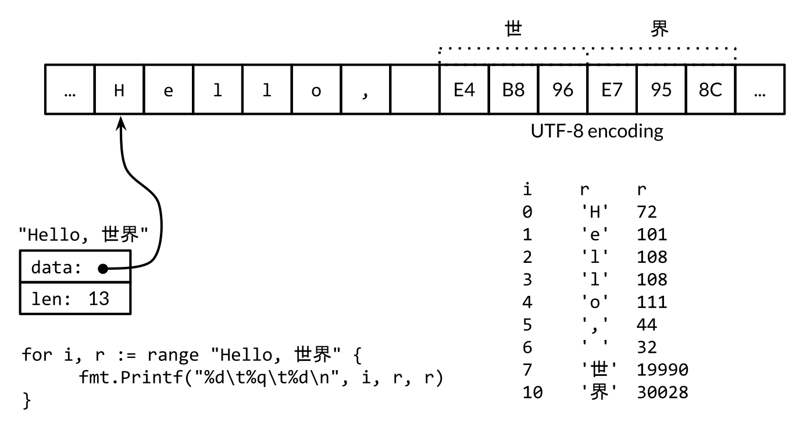
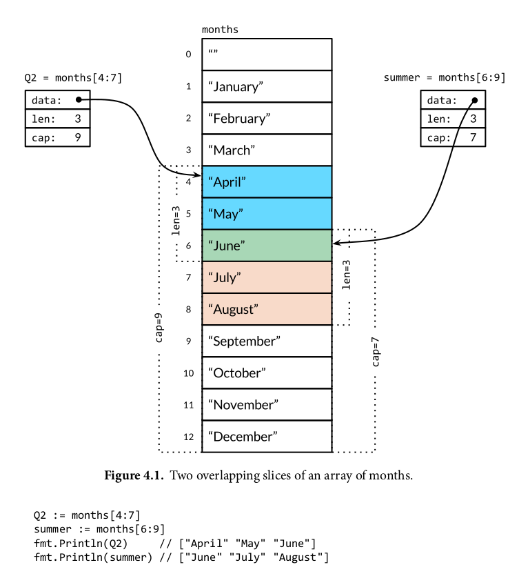
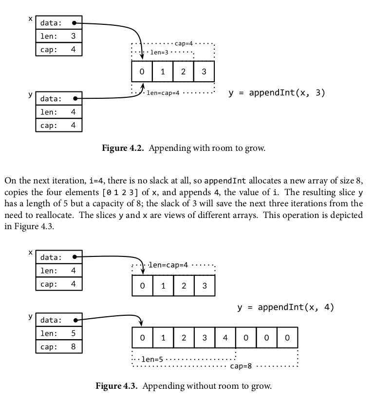

# The Go Programming Language

<!-- @import "[TOC]" {cmd="toc" depthFrom=2 depthTo=6 orderedList=false} -->

<!-- code_chunk_output -->

- [Program Sturcture](#program-sturcture)
  - [Reserved Names](#reserved-names)
  - [Declarations](#declarations)
  - [Variables](#variables)
    - [Short Variable Declarations](#short-variable-declarations)
    - [Pointers](#pointers)
    - [The new function](#the-new-function)
    - [Lifetime of Varianles](#lifetime-of-varianles)
  - [Assignments](#assignments)
    - [Tuple Assignments](#tuple-assignments)
    - [Assignability](#assignability)
  - [Type Declarations](#type-declarations)
  - [Packages and Files](#packages-and-files)
    - [Imports](#imports)
    - [Package Initialiation](#package-initialiation)
  - [Scope](#scope)
- [Basic Data Types](#basic-data-types)
  - [Intergers](#intergers)
  - [Floating-Point Numbers](#floating-point-numbers)
  - [Complex Numbers](#complex-numbers)
  - [Boolean](#boolean)
- [Strings](#strings)
  - [String Literals](#string-literals)
  - [Unicode](#unicode)
  - [UTF-8](#utf-8)
  - [Strings and Byte Slices](#strings-and-byte-slices)
  - [Conversions between Strings and Numbers](#conversions-between-strings-and-numbers)
  - [Constants](#constants)
    - [The Constant Generator iota](#the-constant-generator-iota)
    - [Untyped Constants](#untyped-constants)
- [Composite Types](#composite-types)
  - [Arrays](#arrays)
  - [Slices](#slices)
    - [The append Function](#the-append-function)
    - [In-Place Slice Techniques](#in-place-slice-techniques)
  - [Maps](#maps)
  - [Structs](#structs)
    - [Struct Literals](#struct-literals)
    - [Comparing Structs](#comparing-structs)
    - [Sturct Embedding and Anonymous fields](#sturct-embedding-and-anonymous-fields)
    - [Json](#json)
    - [Text and HTML Templates](#text-and-html-templates)
- [fmt](#fmt)

<!-- /code_chunk_output -->

## Program Sturcture

### Reserved Names

```
break        default      func         interface    select
case         defer        go           map          struct
chan         else         goto         package      switch
const        fallthrough  if           range        type
continue     for          import       return       var
```

[https://golang.google.cn/ref/spec#Keywords]

### Declarations

4 Kinds

- var
- const
- type 
- func 

### Variables

> If the expression is omitt ed, the initial value is the zero value for the typ e, which is 0 for numbers, **false** for boole ans, "" for str ings, and nil for int erfaces and reference typ es (slice, point er, map, channel, function)

#### Short Variable Declarations

`A short variable delaraiion does not necessaily declare all the variable on itss left-hand side. `But it should at least declare a new one.

```go
// Ok
in, err := os.Open(infile)
out, err := os.Open(outfile)
```

```go
f, err := os.Open(infile)
f, err := os.Create(outfile) // compile error: no new variables
```

#### Pointers

#### The new function

> The expression new(T) creates an unname d variab le of typ e T , initializes it to the zero value of T , and retur ns its address, which is a value of typ e *T .

```go
p := new(int)   // p, of type *int, points to an unnamed int variable
fmt.Println(*p) // "0"
*p = 2          // sets the unnamed int to 2
fmt.Println(*p) // "2"
```

#### Lifetime of Varianles

### Assignments

#### Tuple Assignments

```go
a[i], a[j] = a[j], a[i]
```

#### Assignability

### Type Declarations

```go
type Celsisus folat64
type Fahrenheit float64
```

### Packages and Files

#### Imports

#### Package Initialiation

### Scope

## Basic Data Types

Types:

- basic types
- aggregate types
- reference types
- interface types

### Intergers

rune == int32
byte == unit8
int != uint (same bits, but need explict onversion)

-5 % 3 = -2
-5 % -3 = -2

len() return `signed integer`

### Floating-Point Numbers

- float32
- float64, use this 

###  Complex Numbers

- complex64 (float32)
- complex128 (float64)

```go
var x = complex(1, 2)
y := 3 + 4i
```

### Boolean

x == true, or simply x 

short-circuit:
s != "" && s[0] == 'x'

## Strings

Immutable

### String Literals


> Raw str ing lit erals are a convenient way to write regular expressions, which tend to have lots of backsl ashes. They are also us eful for HTML templ ates, JSON lit erals, command usage messages, and the like, which often extend over multiple lines.

```go
const GoUsage = `Go is a tool for manging Go source code.

Usage:
    go command [arguments]
`
```

### Unicode

### UTF-8

binary | range  | values
-------|--------|---
0xxxxxx| runes 0−127 | (ASCII)
11xxxxx 10xxxxxx| 128−2047 |(values <128 unused)
110xxxx 10xxxxxx 10xxxxxx | 2048−65535 | (values <2048 unused)
1110xxx 10xxxxxx 10xxxxxx 10xxxxxx | 65536−0x10ffff | (other values unused)


```go
import "unicode/utf8"

s := "Hello, 世界"
fmt.Println(len(s)) // "13"
fmt.Println(utf8.RuneCountInString(s)) // "9"
```



### Strings and Byte Slices

> A string contains an array of bytes that, once created, is immutable. By contrast, the elements of a byte slice can be freely modified.

```go
s := "abc"
b := []byte(s)
s2 := string(b)
```

### Conversions between Strings and Numbers

```go
x := 123
y := fmt.Sprintf ("%d", x)
fmt.Println (y, strconv.Itoa(x)) // "123 123"


x, err := strconv.Atoi ("123") // x is int
y, err := strconv.ParseInt("123", 10, 64) // base 10, up to 64 bits
```

### Constants

#### The Constant Generator iota

```go
const (
    _ = 1 << (1 * iota)
    KiB  // 1024
    MiB  // 1024 * 1024
    GiB  // 1024 * 1024 * 1024
)
)
```

#### Untyped Constants

## Composite Types

- Array:  homogeneous data type, fixed size
- Slices & Maps: dynamic size


### Arrays

```go
var a [3]int
fmt.Println(a[0])
frmt.Println(a[len(a)-1])

// Index and elements
for i, v := range a {

}

// elements
for _, v := range a {

}

//auto size
q := [...]int{1, 2, 3}

type Currency int
const (
    USD Currency = iota
    EUR
    GBP
    RMB
)

symbol := [...]string{USD: "$", EUR: "e", GBP: "f", RMB: "y", 26: 'z'} // 27 elements
```

> 数组作为参数时是传值的（复制）

### Slices



```go
// array
a := [...]int{1, 2, 3}
// slice
s := []int{1, 2, 3}

var s [] int    // len(s) == 0, s == nil
s = nil         // len(s) == 0, s == nil
s = []int(nil)  // len(s) == 0, s == nil
s = []int{}     // len(s) == 0, s != nil

// not s == nil
if len(s) == 0 {

}

make ([]T, len)
make ([]T, len, cap)
```

#### The append Function



```go
var x []int
x = append (x, 1) // assign it back to x
```

#### In-Place Slice Techniques

```go
func noempty(strings []string) []string {
    i := 0
    for _, s := range strings {
        if s != "" {
            strings[i] = s
            i++
        }
    }
}

// stack
stack = append(stack, v)
top := stack[len(stack) - 1]
// stack shrink
stack = stack[:len(stack) - 1] // error if stack is empty


// preserve order
func remove(slice []int, i int) []int {
    copy(slice[i:], slice[i+1:])
    return slice[:len(slice)-1]
}

// out of order
func remove(slice []int, i int) []int {
    slice[i] = slice[len(i) - 1]
    return slice[:len(slice)-1]
}
```

### Maps


```go
ages := make(map[string]int)
// or ages := map[string]int{}

ages["alice"] = 31

delete(ages, "alice")

// no need to init
ages["bob"] // 0, the default empyt value
ages["bob"] += 1

// iter
for name, age := range {
    // do something
}

// iter by order
import "sort"
names := make ([]string, 0, len(ages))
for name := range ages {
    names = append (names, name)
}
sort.Strings(names)
for _, name := range names {
    fmt.Printf ("%s\t%d\n", name, ages[name])
}

// exists of not
age, ok := ages["bob"]
if !ok { /* error handler */ }

```

### Structs

#### Struct Literals

#### Comparing Structs

If all fields of a struct are comparable, the struct itself is comparable.

#### Sturct Embedding and Anonymous fields

```go
type Point struct {
   X, Y int 
}

type Circle struct {
    Point
    Radius int
}

type Wheel struct {
    Circle
    Spokes int
}

var w Wheel
w.X = 8
w.Y = 8
w.Radius = 5
w.Spokes = 20

w = Wheel{8, 8, 5, 20} // compile error
w = Wheel{X: 8, Y: 8, Radius: 5, Spokes: 20} // compile error

w = Wheel {
    Circle: Circle {
        Point: Point{X: 8, Y:8},
        Radius: 5,
    },
    Spokes: 20,  // comma is necessary
}

fmt.Printf("%#v\n", w) // notice the # sign here, it print the field names
// main.Wheel{Circle:main.Circle{Point:main.Point{X:8, Y:8}, Radius:5}, Spokes:20}
```

#### Json

#### Text and HTML Templates


## Functions

### Function Declarations 

```
func name(parameter-list) (return-list) {

}
```

### Recursion

```go
func hello (a []string) []string {
    return append(a, "hello");
}
fmt.Println(hello(nil))
```

### Multiple Return Values

```go
func CountWordsAndImages(url string) (words, images int, err error) {
    resp, err := http.Get(url)
    if err != nil {
        return
    }
    /...
    return
```

> Go’s garbage collector recycles unused memory, but do not assume it will release unused operating system resources like open files and network connection s. They should be clos edexplicitly.

### Errors

#### Error-Handling Strategies


1. Propagate the errror

```go
resp, err := http.Get(url)
if err != nil {
    return nil, err
}
```

2. Retry the operations


sleep and retry (exponential backoff)

3. Stop the program

should reserved for main package

```go
if err {
    os.Exit(1)
}

if err {
    log.Fatalf("desc of error")
}
```

4. log and continue

with reduced functionality

5. ignore the error

#### End of File(EOF)

```go
in := bufio.NewReader(os.Stdin)
for {
    r, _, err := in.ReadRune()
    if err == io.EOF {
        break // finished reading
    }
    if err != nil {
        return fmt.Errorf ("read failed: %v", err)
    }

    //
}
```

#### Function Values

```go
func square(n int) int { return n * n }
func negative(n int) int { return -n }
func product(m, n int) int { return m * n }

var f func(int) int

f = square
fmt.Println(f(3)) // "9"
f = negative
fmt.Println(f(3))
// "-3"
fmt.Printf("%T\n", f) // "func(int) int"
f = product // compile error: can't assign f(int, int) int to f(int) int
```

### Anonymous Functions

```go
strings.Map (func(r rune) rune {return r + 1,  "HAL-9000") // IBM:.111
```

enclosure

```go
func squares() (func() int) {
    var x int
    return func() int {
        x++
        return x * x
    }
}
```

#### Caveat: Capturing Iteration Variables

```go
var rmdirs []func()

for _, d := range tempDirs() {
    dir := d                // <=== the workaround, declare a variable in each loop
    os.MkdirAll (dir, 0755)
    rmdirs = append 9rmdirs, func() {
        os.RemovaAll(dir)
    })
}

for _, rmdir := range rmdirs {
    rmdir()
}
```

### Variadic Functions

```go
func sum(vals ...int) int {
    total := 0
    for _, val := range vals {
        total += val
    }
    return total
}
```

### Defered Function Calls

1. Release resources/locks...

```go
mu.Lock()
defer mu.Unlock()
```

2. on entry/exit pair

```go
func bigSlowOperation() {
    defer trace ("bigSlowOperation") () // don't forget the //

    time.Sleep (10 * time.Second)
}

func trace (msg string) func () {
    start := time.Now()
    log.Printf ("enter %s", msg)
    return func {log.Printf ("exit %s (%s)", msg, time.Since(start)) }
}
```

> Deferred functions run after return statments have updated the function's result variables.

```go
func docuble(x int) (result int) {
    defer func() {fmt.Printf("double(%d) = %d\n", x, result)}
    return x + x
}
```

> A deferred anonymous function can even change the values that the enclosing function returns to its caller:

```go
func triple (x int) {
    defer func() {result += x}()
    return double(x)
}
```

### Panic

```go
func MustCompile (expr string) *Regexp {
    re, err := Compile (expr)
    if err != nil {
        panic (err)
    }
    return re
}
```

### Recover

> If the built-in recover function is called within a deferred function and the function containing the defer statement is panicking, recover ends the current state of panic and returns the panic value.

```go
func Parse(input Stringl) (s *Syntax, err error) {
    defer func() {
        if p := recover(); p != nil {
            err = fmt.Errorf ("internal error: %v", p)
        }
    }
}
```

```go
package main

import "fmt"

func f() (err error) {
	defer func() {
		if p := recover(); p != nil { // recover() return the panic value
			fmt.Printf("%T %[1]v\n", p) // string oops
			err = fmt.Errorf("internal error: %v", p)
		}
	}()

	panic("oops")

	return nil
}

func main() {
	err := f()
	if err != nil {
		fmt.Println(err)
	}
}
```

> This example does somewhat violate our advice about not using panics for ‘‘expected’’ error s, but it provides a compact illustrat ion of the mechanics.

```go
func soleTitle(doc *html.Node) (title string, err error) {
    type bailout struct{}
    defer func() {
        switch p := recover(); p {
            case nil:
                // no panic
            case bailout{}:
                // "expected" panic
                err = fmt.Errorf("multiple title elements")
            default:
                panic(p) // unexpected panic; carry on panicking
        }
    }()

    panic (bailout{})

}
```

## Methods

### Method Declarations

```go
type Point sturct {X, Y float64}

func Distance (p, q Point ) float64 {
    return mmath.Hypot (q.X-p.X, q.Y-p.Y)
}

type Path []Point
func (path Path)Distance() float64 {
    sum := 0.0
    for I := range path {
        if i > 0 {
            sum += path[i-1].Distance(path[i])
        }
    }
}
```

### Methods with a Pointer Receiver

> Because calling a function makes a copy of each argument value, if a function needs to update a variable, or if an argument is so large that we wish to avoid copy ing it, we must pass the address of the variable using a pointer.

```go
func (p *Point) ScapleBy (factor float64) {
    p.X *= factor
    p.Y *= factor
}

p := Point {1, 2}
pptr = &p
```

> Either the receiver argument has the same type as the receiver parameters, for example both habe type T or both have type *T

```go
Point{1, 2}.Distance(q) // Point
pptr.ScaleBy(2) // *Point

```

> Or the receiver arugment is a bariable of type T nd the receiver parameter has type *T. The compiler implicityly takes the address of the variable.

```go
p.ScaleBy(2)    // implicit (&p)
```

> Or the receiver arugment has type *T and the receiver parameter has type T. The compiler implicitly dereferences the receiver, in other words, load the value:

```go
pptr.Distance (q) // implicit (*pptr)
```

#### Nil Is a Valid Receiver Value

```go
type IntList struct {
    Value int
    Tail *IntList
}

func (list *IntList)sum int {
    if list == nil {    // could be nil
        return 0
    }
    return list.Value + list.Tail.Sum()
}
```

### Composing Types by Struct Embedding


```go
import "image/color"
type Pooint struct {X, Y folat64}

type ColoredPoint struct {
    Point
    COlor color.RGBA
}

red := color.RGBA{255, 0, 0, 255}
var p = ColoredPoint {Point{1,1}, red}
var q = ColoredPoint {Point{5,4}, red}

p.Distance (q.Point) // 注意它的参数，是Point
```

** A struct type may have more than one anonymous field. **

```go
type ColoredPoint struct {
    Point
    color.RGBA
}
```

trick to define method for unamed structure

```go
var cache = struct {            // 定义一个未命名的struct
    sync.Mutex
    mapping map[string]string
} {                             // 实例化一个struct
    mapping: make (map[string])string, 
}

func Lookup (key string) string {
    cache.Lock()                // <=== 直接调用Mutex方法
    v := cache.maping[key]
    cache.Unock()
    return v
}
```

### Method Values and Expressions

```go
type Rocket struct { /* ... */ }
func (r *Rocket) Launch() { /* ... */ }

time.AfterFunc ( 10 * time.Second, r.Launch())
// or time.AfterFunc (10 * time.Second, func() { r.Launch() } )

```

```go
type Point struct{ X, Y float64 }

func (p Point) Distance(q Point) float64 {
	return math.Hypot(q.X-p.X, q.Y-p.Y)
}

func main() {
	p := Point{1, 2}
	q := Point{4, 6}
	mv := p.Distance // method value

	fmt.Printf("%T\n", mv) // func(main.Point) float64
	fmt.Println(mv(q))

	me := Point.Distance // method expression
	fmt.Printf("%T\n", me) // func(main.Point, main.Point) float64
	fmt.Println(me(p, q))
}
```

### 

## fmt


```go
ascii := 'a'
fmt.Printf ("%d %[1]c %[1]q\n", ascii) // 97 a 'a'
```